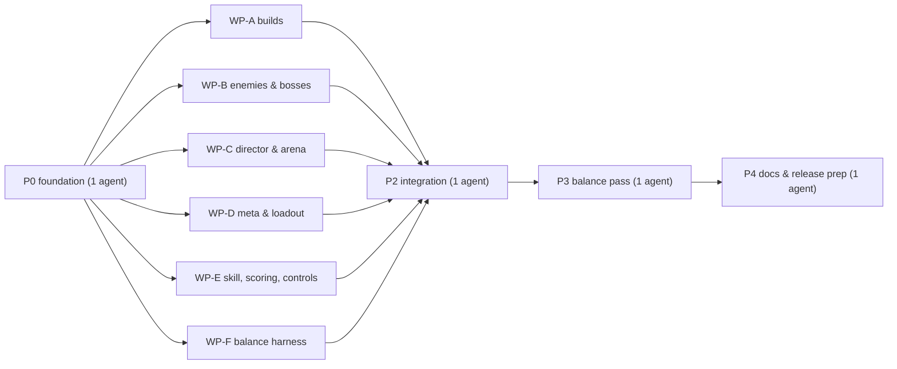

# 11 分階段與工作包

[返回索引](README.md)

每個階段結束都要通過 `node --check`（`src/**/*.js`）與 `node scripts/self-check.mjs`，並在真實瀏覽器完整玩一局。每個階段結束時遊戲都必須可以完整遊玩。

## P0 基礎（單一子代理，順序執行）

- 依 `AGENTS.md` 重新讀取平台 `main` 最新規格，列出本次適用要求。
- 建立 [09](09-architecture.md) 的全部新模組骨架與共用檔案掛鉤：`rng.js`、`meta-store.js` 骨架、`data/enemies.js`（抽出既有數值）、`data/heat.js`（完整 Heat 表與 `getHeatModifiers(heat)`）、`director.js` 骨架（回傳 v0.3 等價配方）、`scoring.js`（`addScore` + 既有評級原樣搬入）、`contracts.js` / `mutators.js` / `meta.js` 空函式、`drops.js`（抽出既有掉落）、`enemy-defense.js`（直通）、`card-effects.js`（空掛鉤：`onDash`、`onEmp`、`onPlayerDamaged`、`onLethal`、`onEnemyHit`、`onKill`、`onPickup`）、`src/dev/checks/*.js` 空檔。
- 共用檔案改動：`state.js` 新欄位；`damagePlayer` / `damageEnemy` / `killEnemy(e, cause)` 傷害入口並替換所有直接扣血；`Math.random` → `rng(stream)`；`update.js` 掛鉤；`flow.js` 掛鉤與 `extractRun()`；`spawning.js` 改讀配方；`timers-wave.js` 掛鉤；衝刺多段充能（預設 1 段）；`batteryMax` / `batteryRegen` / `empCost` 參數化；移除武器切換輸入；`hud.js` 掛鉤與 `ACT · WAVE`；overlay 通用首領血條；`palette.js` 讀 `state.sector`；`index.html` 空容器與空樣式檔連結；暫停 SYSTEM 分頁加 `TIPS` 開關與 `RESET TIPS`（設定讀寫在 `meta-store.js`）；fx.js 加 `burst` 事件。
- 驗收：行為與 v0.3.0 等價（除武器切換輸入移除），自檢全通過，瀏覽器實玩正常。
- 交付：一份「掛鉤契約」回報（每個模組的匯出函式、呼叫時機、參數），後續工作包逐字依賴。

## P1 並行工作包

各工作包只改「擁有」欄的檔案；需要改別人的檔案時，在回報中寫明確的改動需求，由整合階段處理。

| WP | 範圍 | 擁有的檔案 |
| --- | --- | --- |
| **A 構築** | [03](03-builds-and-weapons.md)：稀有度、上限、重抽／放逐／跳過、新卡 14 張、新融合 4 個、XP 曲線、Mastery、武器專屬卡、構築頁只讀 | `src/data/upgrades.js`、`src/systems/progression.js`、`src/systems/weapons.js`、`src/systems/sim/bullets.js`、`src/systems/card-effects.js`、`src/ui/upgrade-panel.js`、`src/ui/pause-menu.js`、`css/upgrades.css`、`css/pause-menu.css`、`src/dev/checks/build.js` |
| **B 敵人與首領** | [04](04-enemies-and-bosses.md)：4 新敵型、2 新首領、2 新詞綴、彈幕成長、敵彈池上限、相關渲染 | `src/data/enemies.js`、`src/systems/spawning.js`、`src/systems/sim/enemies.js`、`src/systems/sim/enemy-bullets.js`、`src/systems/sim/new-enemies.js`、`src/systems/sim/bosses.js`、`src/systems/sim/enemy-defense.js`、`src/render/enemies.js`、`src/render/projectiles.js`、`src/render/shadows.js`、`src/dev/checks/enemies.js` |
| **C 導演與戰場** | [02](02-run-structure.md)、[05](05-arena-and-events.md)：三幕、難度曲線、首領排程、幕間與撤離、無盡、路線、突變、合約、補給箱、運輸車、油桶連鎖 | `src/systems/director.js`、`src/systems/mutators.js`、`src/systems/contracts.js`、`src/systems/drops.js`、`src/systems/interlude.js`、`src/data/routes.js`、`src/data/mutators.js`、`src/data/contracts.js`、`src/systems/sim/timers-wave.js`、`src/systems/sim/hazards.js`、`src/systems/sim/orbs.js`、`src/render/world.js`、`src/ui/interlude-panel.js`、`src/ui/contracts-hud.js`、`css/interlude.css`、`css/contracts.css`、`src/dev/checks/director.js` |
| **D 局外成長與配裝** | [07](07-meta-progression.md)、[08](08-ui-ux.md) 的開局配裝與圖鑑：機體、Heat 選擇、成就、統計、每日挑戰、存檔 | `src/core/meta-store.js`、`src/data/rigs.js`、`src/data/daily.js`、`src/systems/meta.js`、`src/ui/loadout-panel.js`、`src/ui/codex-panel.js`、`css/loadout.css`、`css/codex.css`、`src/dev/checks/meta.js` |
| **E 技巧、計分、操作** | [06](06-skill-scoring-controls.md)：Just Dash 過熱、新計分與倍率、評級、手機 EMP 拖曳與黏性鎖定、手把與鍵盤修正、新手提示 | `src/systems/scoring.js`、`src/systems/abilities.js`、`src/input/keyboard-pointer.js`、`src/input/gamepad.js`、`src/ui/tips.js`、`css/touch.css`、`src/dev/checks/scoring.js` |
| **F 平衡模擬器** | [10](10-balance-sheet.md#校準方法)：`scripts/balance-sim.mjs`、機器人策略、報表；先對 P0 狀態可運作，並對 v0.3.0 基準跑一次存檔 | `scripts/balance-sim.mjs`、`scripts/balance/*.mjs`、`output/balance/*` |

### 工作包之間的介面

- **A ↔ E**：卡牌效果只改玩家欄位或實作 `card-effects.js` 的掛鉤；衝刺與 EMP 的觸發邏輯在 E 的 `abilities.js`，它在對應時機呼叫 `onDash` / `onEmp`。
- **B ↔ C**：C 的導演產生 `state.recipe`（權重、倍率、首領排程）；B 的 `spawnEnemy` 與首領生成函式讀它。首領生成由 C 呼叫 B 匯出的 `spawnBoss(kind)`。首領死亡由 `killEnemy` 呼叫 C 的 `onBossDefeated`。
- **C ↔ D**：Heat 與每日規則由 D 的 `data/heat.js`（P0 已完成）與 `data/daily.js` 提供；C 的導演在 `planWave` 讀取。
- **C ↔ E**：合約需要的事件（擦彈、Just Dash、油桶擊殺）由各觸發點呼叫 `noteContractEvent`；E 在 `abilities.js` 的 Just Dash 處呼叫，P0 已在 combat／敵彈處接好。
- **D ↔ 全部**：`noteMetaEvent(kind, data)` 由 P0 接在擊殺、Just Dash、合約完成、首領擊殺、過波處；D 只實作函式內容。
- **渲染**：B 擁有敵人與敵彈渲染；C 擁有世界物件渲染；視覺事件只用 `burst` 與既有種類。

### 並行注意事項

- 所有子代理在同一個工作目錄同時修改，不得修改擁有清單以外的檔案。
- 瀏覽器測試使用各自的連接埠：A 8171、B 8172、C 8173、D 8174、E 8175、F 不需要。
- 別人的檔案暫時壞掉時，等待後重試並回報，不要動手修。
- 本機 shell 需要 `required_permissions: ["all"]`。自動化瀏覽器先靜音。

## P2 整合（單一子代理）

- 依各工作包回報處理跨檔需求（fx 新事件種類、音效、HUD 細節、彼此呼叫）。
- 全部自檢分檔通過；完整遊玩：三幕、三首領、幕間、撤離、無盡至第 20 波（可加速）、每日挑戰、各機體、Heat。
- 更新 `ARCHITECTURE.md`（依其維護規則）。

## P3 平衡（單一子代理）

- 以 WP-F 模擬器跑 v0.3.0 基準與 v0.4.0；依 [10](10-balance-sheet.md) 的目標調整 `src/data/*.js`。
- 校準評級門檻；確認效能（新敵型與首領的最壞情況幀成本）。

## P4 文件與發布準備（單一子代理 + 審核者）

- `game.json`：`version` → `0.4.0`、`leaderboard.id` → `dust-reign-score-v2`。
- `CHANGELOG.md` V0.4.0、`RELEASE.md` 驗收與平衡紀錄。
- 重拍 `cover.png`；`node scripts/stage-release.mjs`；平台 `main` 最新工具 `game:pack` / `game:validate`；跨來源 sandbox iframe 桌面與手機實測。
- 不建立 tag 或 Release，除非使用者明確要求。
