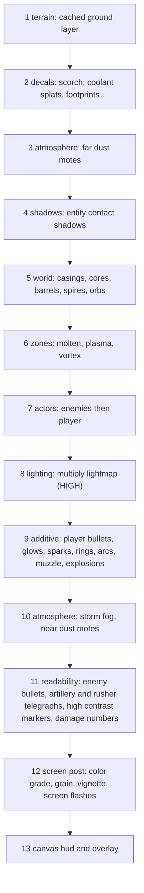

# 02 渲染架構改造

[返回索引](README.md)

## 新增與改寫的模組

```text
src/render/
├── draw.js          # 改寫：新的圖層順序、render clock、後處理串接
├── palette.js       # 新增：調色盤與區段色調插值
├── quality.js       # 新增：畫質分級、自動降級、各級預算
├── sprites.js       # 新增：預渲染光暈 / 粒子 / 雜訊貼圖快取（取代 shadowBlur）
├── terrain.js       # 新增：地表離屏快取（沙地雜訊、沙丘、裂縫、殘骸、投影）
├── atmosphere.js    # 新增：浮塵、風暴霧帶、色彩分級、膠片顆粒、動態暗角
├── lighting.js      # 新增：半解析度 lightmap（HIGH 限定）
├── fx.js            # 新增：視覺專用粒子池（火花、煙、餘燼、碎片、閃光）、傷害數字、螢幕閃光
├── shadows.js       # 新增：統一的實體接地陰影
├── world.js         # 改寫：核心、燃油桶、避雷柱、掉落物、彈殼、焦痕
├── enemies.js       # 改寫：6 種敵型造型、受擊閃白、出生 / 死亡動畫
├── player.js        # 改寫：機甲造型、4 種武器外型、推進器、超頻光環、低血量損傷
├── projectiles.js   # 改寫：子彈光頭、敵彈脈動、碎形電弧、EMP / 震波環、黑洞
└── overlay.js       # 改寫：波次橫幅、Titan 血條、死亡 CRT 坍縮強化

src/core/
└── fx-events.js     # 新增：sim → render 的視覺事件環形佇列（見 06-combat-vfx.md）
```

`world.js` 現有的 `drawBackground` 拆到 `terrain.js` + `atmosphere.js`；`drawParticles` 移到 `fx.js`。

## Render clock

`draw()` 目前沒有 `dt`，動畫只靠 `state.waveTime`（暫停、hitstop 時凍結）。新增：

- `rt.renderTime`、`rt.renderDt`：在 `src/main.js` 的 `frame()` 中更新，暫停時仍前進，讓浮塵、待機呼吸、UI 背景持續有生命感。
- 戰鬥相關動畫（敵人擺動、子彈）仍使用 `state.waveTime`，hitstop 頓幀的凍結手感不變。
- `rt` 新增欄位（`renderTime`、`renderDt`、`fxEvents`）需寫入 `ARCHITECTURE.md` 1.1 的 `rt` 清單。

## 圖層順序



重點：

- **光暈畫在 lightmap 之後**（第 9 層）：發光物不會被環境暗化壓暗，才能形成「暗場中的亮點」。
- **可讀性層**（第 11 層）在霧帶之上：敵彈、迫擊砲預警圈、Rusher 衝刺預警線、高對比標記永遠不被暗化或霧帶遮住。迫擊砲預警從現在的 zones 層移到這裡；熔岩燃燒區留在第 6 層。
- 子彈從原本的「敵人之前」改為「敵人之後」繪製，避免被敵人本體遮住而看不清彈道。
- **全面移除 `shadowBlur`**（現有約 40 處，是目前最大的效能成本），改用預渲染光暈貼圖 + `globalCompositeOperation = 'lighter'`。
- **震屏範圍**：第 1–11 層屬於世界座標，跟著震屏位移；第 12–13 層屬於螢幕座標（色彩分級、暗角、閃光、HUD），不跟著抖，畫面更穩。
- 現在 `draw.js` 末端的全畫面淡紅受傷填色移除，改由第 12 層的紅色邊緣暗角取代（見 [06-combat-vfx.md](06-combat-vfx.md)）。

## 畫質分級（`src/render/quality.js`）

- 設定值：`auto`（預設）/ `high` / `medium` / `low`，存在 `dust_reign_visual_quality`。
- `auto` 初始：桌面（`pointer: fine`）為 HIGH，觸控裝置為 MEDIUM。
- 自動降級：以 `rt.renderDt` 統計 90 幀滑動平均，連續超過 19ms 即降一級；同一局內不自動升級，避免來回跳動。分頁切到背景後回來的第一幀（`dt` 被夾到 0.05）不計入統計。
- 暫停面板 SYSTEM 分頁新增 `#settingVisualQuality`（按鈕循環：AUTO / HIGH / MEDIUM / LOW），樣式沿用 `.pause-setting-btn`；讀寫放在 `src/core/settings.js`，UI 同步放在 `src/ui/pause-menu.js` 的 `updateSettingsUi`。
- 手動選擇固定等級時不做自動降級。

各級預算：

- **HIGH**：lightmap 開、膠片顆粒開、視覺粒子上限 900、浮塵 140 顆、地表細節全開、碎形電弧 3 層分岔。
- **MEDIUM**：lightmap 關（改用加法光暈 + 暗角模擬）、顆粒關、粒子上限 500、浮塵 70 顆、電弧 2 層。
- **LOW**：只保留關鍵光暈（玩家、敵彈、爆炸），粒子上限 260、無浮塵、地表簡化、電弧 1 層。
- 任何畫質下，敵彈、預警圈、可互動物件的**可讀性**都不能低於現況。

## 貼圖快取（`src/render/sprites.js`）

- `getGlowSprite(color, size)`：離屏 canvas 繪製放射漸層圓，依 `color|size` 快取；`drawGlow(ctx, x, y, radius, color, alpha)` 以 `drawImage` 繪出。size 量化到固定級距（例如 16 / 32 / 64 / 128 / 256），避免快取爆量。
- `getNoiseTile()`：128×128 雜訊貼圖，供沙地紋理與膠片顆粒使用。
- 快取在 `resize()` 或 DPR 改變時清空重建；總數設上限（例如 64 張），超過以 LRU 淘汰。
- 沒有 `document` 的環境（Node self-check）全部 no-op。
