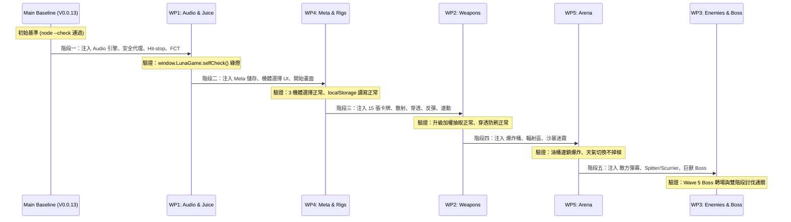

# DUST//REIGN 多 Agent 並行執行架構矩陣（Parallel Execution Matrix）

> **目的**：提供 4~5 個 Subagent / 開發人員同時在單一前端代碼庫（`game.js`、`index.html`、`styles.css`）上並行開發時的**絕對防衝突規範**、**介面合約**、**圖層與迴圈插槽分配**以及**合併驗收順序**。

---

## 1. 並行分工與責任邊界總覽（Work Packages Division）

| 工作包代號 | 責任領域 | 專屬並行工單 | 專屬狀態容器（State Scope） | 主要切入函式（Functions） |
| :--- | :--- | :--- | :--- | :--- |
| **WP1** | **視聽回饋與打擊感** | [wp-01-audio-and-game-juice.md](file:///F:/Desktop/Luna/plans/wp-01-audio-and-game-juice.md) | `state.hitStop`, `state.trauma`, `fctPool: []`, `ui.scorchCanvas` | `createAudioEngine()`, `frame()` 凍結, `draw()` 震動旋轉, `stampCorpse()` |
| **WP2** | **武器彈道與升級矩陣** | [wp-02-weapons-and-synergies.md](file:///F:/Desktop/Luna/plans/wp-02-weapons-and-synergies.md) | `player.multishot`, `player.pierce`, `player.ricochet`, `player.droneCount`, `state.flameTrails`, `state.empWaves` | `shoot()`, `UPGRADES` 陣列, `randomUpgradeChoices()`, `updateBullets()` |
| **WP3** | **敵人 AI 與巨獸首領** | [wp-03-enemy-ai-and-bosses.md](file:///F:/Desktop/Luna/plans/wp-03-enemy-ai-and-bosses.md) | `state.enemyBullets: []`, `state.boss`, `state.bossWarning` | `updateEnemyBullets()`, `updateEnemyAI()`, `killEnemy()` 殉爆/掉落, `updateWaveDirector()` |
| **WP4** | **機體自選與局外成長** | [wp-04-meta-progression-and-rigs.md](file:///F:/Desktop/Luna/plans/wp-04-meta-progression-and-rigs.md) | `player.rigId`, `player.dashCharges`, `localStorage['dustReignMeta']` | `getMeta()`, `saveMeta()`, `RIG_CONFIGS`, `applyRigToPlayer()`, `#rigSelector` UI |
| **WP5** | **動態戰場與可破壞物** | [wp-05-dynamic-arena-and-hazards.md](file:///F:/Desktop/Luna/plans/wp-05-dynamic-arena-and-hazards.md) | `state.barrels: []`, `state.hazardZones: []`, `state.weather` | `explodeBarrel()`, `updateHazardZones()`, `updateWeather()`, `drawWeatherOverlay()` |

---

## 2. 核心防衝突合約（Conflict-Free Inter-Agent Contracts）

### 2.1 全域安全音訊代理（Safe Audio Proxy）—— WP1 提供
所有其他模組（武器射擊、怪物死亡、爆炸桶引爆、衝刺、升級）嚴禁直接操作 AudioContext。統一呼叫：
```javascript
window.LunaGame.audio.play(eventName, args);
```
- **保證**：若音效模組尚未載入或因無音效卡/瀏覽器 Autoplay 靜音，呼叫自動靜默（No-op），絕不中斷戰鬥主迴圈。

### 2.2 子彈與碰撞雙軌隔離（Bullet Isolation）—— WP2 & WP3
- **玩家子彈**：存於 `state.bullets: []`。僅遍歷 `state.enemies` 與 `state.barrels`（WP5 插槽）。
- **敵方子彈**：存於 `state.enemyBullets: []`。僅遍歷 `state.player` 檢測擦彈與扣血。
- **保證**：雙方迴圈與陣列完全獨立，不發生遍歷競爭或陣列越界。

### 2.3 敵怪實體通用唯一標識（Entity ID Protocol）—— WP2 & WP3
- 生成敵人時指派 `enemy.id = ++state.nextEnemyId;`。
- WP2 穿透子彈透過 `b.hits.indexOf(enemy.id)` 防重複扣血。
- WP2 提供防禦性回退：`if (!enemy.id) enemy.id = ++state.nextEnemyId;`，即使 WP3 尚未合併亦可獨立測試。

### 2.4 機體數值增量修補（Non-Destructive Rig Patching）—— WP4 提供
- WP4 定義 `RIG_CONFIGS`，在 `makeState()` 內部以 `applyRigToPlayer(player, rigId)` 增量賦值。
- **嚴禁全量覆蓋**：禁止 `state.player = { ...config }`，保證 WP2 新增的武器天賦欄位不被衝掉。
- 磁吸半徑統約：`var pullRadius = player.magnetRadius || 165;`（WP2 與 WP4 共享同一屬性名）。

### 2.5 環境容器零污染（Isolated Hazard Scope）—— WP5 提供
- 爆炸桶存於 `state.barrels`，酸霧存於 `state.hazardZones`，嚴禁混入 `state.enemies`，保證 WP3 的怪群上限計數、Bounty 計數與 WP2 的自瞄索敵不受污染。

---

## 3. 主渲染圖層插槽規範（Canvas 2D Render Pipeline Order）

為避免 5 個 Agent 在 `draw(ctx)` 內部產生修改衝突，主繪製流程劃分為 12 個嚴格排序的專屬圖層插槽：

```text
┌─────────────────────────────────────────────────────────────┐
│ [Layer 01] drawBackground(ctx)           (既有背景與網格)   │
│ [Layer 02] drawScorchStamp(ctx)   ★WP1   (離屏殘骸印章)     │
│ [Layer 03] drawHazardZones(ctx)   ★WP5   (輻射毒霧光暈)     │
│ [Layer 04] drawFlameTrails(ctx)   ★WP2   (Dash 火焰軌跡)    │
│ [Layer 05] drawBarrels(ctx)       ★WP5   (廢料爆炸桶)       │
│ [Layer 06] drawTelegraphs(ctx)    ★WP3   (敵怪/首領預警線)  │
│ [Layer 07] drawOrbs(ctx)                 (掉落物)           │
│ [Layer 08] drawBullets(ctx)       ★WP2   (玩家子彈/飛彈/僚機)│
│ [Layer 09] drawEnemyBullets(ctx)  ★WP3   (敵方彈幕)         │
│ [Layer 10] drawEnemies(ctx)       ★WP3   (敵怪與首領巨獸)   │
│ [Layer 11] drawPlayer(ctx)        ★WP4   (機體外觀分化)     │
│ [Layer 12] drawWeatherOverlay(ctx)★WP5   (沙暴迷霧暗角光圈) │
│ [Layer 13] drawFct(ctx)           ★WP1   (浮動傷害跳字)     │
│ [Layer 14] drawHud(ctx)                  (常態 HUD)         │
│ [Layer 15] drawBossBar(ctx)       ★WP3   (首領專屬血條)     │
└─────────────────────────────────────────────────────────────┘
```

---

## 4. 主更新迴圈插槽規範（Update Loop Hooks）

在 `update(dt)` 中，各模組按以下區間各自插入獨立函式呼叫：

```javascript
function update(dt) {
  if (state.paused || state.over) return;

  // --- [Hook 1: 環境與天氣 (WP5)] ---
  updateWeather(dt);

  // --- [Hook 2: 基礎波次推進 (既有)] ---
  state.waveTime += dt;
  updateWaveDirector(dt); // ★WP3 三幕劇編隊替換原 spawnTimer

  // --- [Hook 3: 玩家與機體更新 (WP4)] ---
  updatePlayerMovement(dt);
  updatePlayerDashes(dt);  // ★WP4 多段 Dash 充能

  // --- [Hook 4: 僚機與連動地效 (WP2)] ---
  updateDrones(dt);        // ★WP2 防衛僚機自瞄
  updateFlameTrails(dt);   // ★WP2 火焰地帶 Tick
  updateEmpWaves(dt);      // ★WP2 EMP 擴散

  // --- [Hook 5: 玩家子彈與射擊 (WP2)] ---
  updatePlayerBullets(dt); // ★WP2 穿透、反彈、破片、飛彈

  // --- [Hook 6: 敵方子彈 (WP3)] ---
  updateEnemyBullets(dt);  // ★WP3 敵方彈幕與擦彈判定

  // --- [Hook 7: 環境物件生命週期 (WP5)] ---
  updateBarrels(dt);       // ★WP5 油桶引信與連鎖爆炸
  updateHazardZones(dt);   // ★WP5 輻射減速與腐蝕扣血

  // --- [Hook 8: 敵人 AI 行為樹 (WP3)] ---
  updateEnemiesAI(dt);     // ★WP3 Spitter, Scurrier, Boss

  // --- [Hook 9: 掉落物與磁吸 (既有 + WP2/WP4/WP5)] ---
  updateOrbs(dt);

  // --- [Hook 10: 傷害跳字與打擊感 (WP1)] ---
  updateFct(dt);           // ★WP1 傷害字淡出
  decayTrauma(dt);         // ★WP1 震動衰減
}
```

---

## 5. 合併與驗收順序（Merge Pipeline）

推薦依序合併與推進，每階段均可獨立單元驗證：



---

## 6. 標準交付閉環流程（Implementation → Screenshot → CHANGELOG → Git Commit）

每個 Work Package 或子功能在完成時，**必須強制遵循以下四步閉環流程**，完成原子化交付：

```text
┌─────────────────┐     ┌─────────────────┐     ┌─────────────────┐     ┌─────────────────┐
│ 1. 實作與驗證   │ ──> │ 2. 截圖留痕     │ ──> │ 3. 更新版本日誌 │ ──> │ 4. 本地 Git 提交 │
│ • 遵循工單合約  │     │ • 實機畫面捕捉   │     │ • 寫入 CHANGELOG│     │ • 語意化 Commit  │
│ • node --check  │     │ • screenshots/  │     │ • 記錄版本與截圖 │     │ • 形成乾淨歷史   │
│ • selfCheck()   │     │   v0.0.X-*.png  │     │   相對路徑      │     │                 │
└─────────────────┘     └─────────────────┘     └─────────────────┘     └─────────────────┘
```

### 具體操作規範：
1. **實作與驗證（Implementation & Self-Check）**：
   - 依照工單完成代碼實作。
   - 終端執行 `node --check game.js` 確保 0 語法錯誤。
   - 執行 `window.LunaGame.selfCheck()` 確認所有單元斷言全數通過。
2. **截圖留痕（Screenshot Evidence）**：
   - 運行遊戲捕捉能清晰反映該功能新特性的畫面（如音訊 HUD 狀態、武器彈幕、首領血條、機體選單或沙暴迷霧）。
   - 存放至 `screenshots/v0.0.X-<feature-slug>.png`（嚴格遵循全小寫、連字號命名）。
3. **更新版本日誌（Update CHANGELOG.md）**：
   - 在 `CHANGELOG.md` 頂端新增版本條目（版本號遞增，例如 `## V0.0.14 — 2026-09-09`）。
   - 列出關鍵改動項目，並附上 `畫面：screenshots/v0.0.X-<feature-slug>.png`。
4. **本地 Git 提交（Local Git Commit）**：
   - 將代碼、日誌與截圖納入暫存並提交：
     ```bash
     git add game.js index.html styles.css CHANGELOG.md screenshots/v0.0.X-*.png
     git commit -m "feat(scope): summary of changes (V0.0.X)"
     ```
   - 嚴禁累積多個階段未提交；每個功能點獨立閉環，確保隨時可追溯、可回滾。

